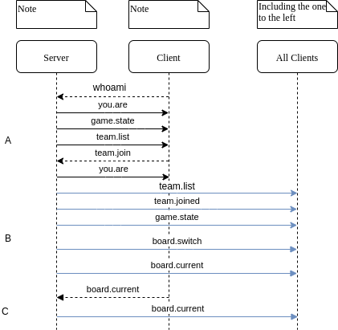

Web Socket Protocol
===================

Communication between the client and the server are done through web sockets using SocketIO. There is nothing fancy
going on, no channels/groups/rooms, just simple events. This document describes the events emitted by *both* sides, what
data they contain, and how they should be handled.

Overview
--------
Since there are going to be no APIs for the frontend to call, the web socket will serve as the API used to get
information to the frontend. This API is implemented in the form of events emitted by the front end requesting the
information, and events emitted by the backend informing the frontend of information. It is important to note that the
backend does not necessarily *respond* to requests, it just sends data. Meaning, there is no distinction between a
response to a request, and the backend pushing data to the frontend unsolicited. They must be handled the same.

For example, when the frontend asks for the current state of the board, the backend will respond the same way it does
when informing **all** clients that the board has changed. This allows us to updated the state of the board in both
cases, without having to have specific logic for both.

Details
-------
With a few exceptions, events follow the naming convention: ``<namespace>.<action>``. For example, the event to join a
team is: ``team.join``, and the event containing the current board data is ``board.current``. The big exceptions are
``whoami`` and ``you.are``, which are primarily housekeeping events dealing with user authentication.

.. note::

   We may want to rename ``whoami`` and ``you.are`` to fit the convention. Something like ``core.whoami`` and
   ``core.youare`` would be fine.

Client Join
-----------

The above diagram represents the protocol for joining a game (**A**), the game starting (**B**), and the client
requesting an update of the board (**C**). There is a bit of individual client housekeeping housekeeping at the start,
and then most of the communication from the server to the clients is in broadcast form.

Joining the game (A)
^^^^^^^^^^^^^^^^^^^^
The very first thing that happens when a client receives the connected event is to emit ``whoami``. This will cause the
server to emit the ``you.are`` event which gives details on who the client is, as far as the server is concerned. This
includes whether the client is authenticated, and admin, and/or what team they are on. The ``whoami`` event has no
payload. The ``you.are`` event will respond as follows:

.. code-block:: javascript

   {
     authenticated: false,
     team: null,
     admin: false
   }

The server will then send the ``game.state`` event which informs the client what state the game is in. This event has
the following payload:

.. code-block:: javascript

   {
      state: "WAITING" // Can be one of WAITING, PLAYING, or FINISHED
   }

Then the server sends the ``team.list`` event, containing the details for all the teams (score, taken/not taken, etc.).
The following payload would be delivered if there are 3 teams, of which only the third team has been claimed.

.. code-block:: javascript

   {
     teams: [
       {id: 1, name: null, taken: false, score: 0},
       {id: 2, name: null, taken: false, score: 0},
       {id: 3, name: "Really Cool Team", taken; true, score: 0}
     ]
   }

At this point, the client needs to present the list of teams to the user to select from. If joining an open team, the
user is required to supply a team name, and re-join password (in case they get disconnected and need to re-join). If
re-joining, they will simply need to supply the same password. The client sends the ``team.join`` event in both cases,
and the differences in payload are trivial:

.. code-block:: javascript

   {
     team: 1, // This is the team id,
     password: "asdf",
     name: "Team Name" // This field only supplied on team creation.
   }

If the password is incorrect during a re-join, or there is some other problem with this command, the server will emit an
``error`` event.

If the join is successful, the server emits another ``you.are`` event with the new details:

.. code-block:: javascript

   {
     authenticated: true,
     team: 1,
     admin: false
   }

This informs the client that the team join was successful and which team they have joined. At the same time, the server
broadcasts a ``team.joined`` event to inform all clients that the team has been created and has a new name. In the case
of a re-join, the broadcast still happens. This is done in case a client has stale information. The payload for this
event is as follows:

.. code-block:: javascript

   {
     team: 1,
     name: "Best Team"
   }

At this point the client has fully joined the game.

Starting the game (B)
^^^^^^^^^^^^^^^^^^^^^
At this point, the admin has determined they are ready to start the game and used the client functionality to signal
this. The admin client will then broadcast ``game.start``, which has no payload, telling the server to start the game.
This will cause the server to send a ``game.state`` event, with a state of ``PLAYING``. It is at this point that the
clients should start preparing the displays for the game board. Immediately following the ``game.start``, a
``board.switch`` event will be broadcast.

A board switch is a warning to the clients that the server is about to switch boards. It means they should activate any
loading/waiting indicators in the frontend as well as clear the current board. It also includes the board type. The
exact payload is as follows:

.. code-block:: javascript

   {
     id: 1,
     name: "First Round",
     type: "standard" // Can be either standard or final
   }

Then the server immediately broadcasts the ``board.current`` event. This event contains all the data necessary to build
the board. The exact payload is different depending on the client. For example, admin's receive all data, whereas teams
and observers receive only enough data to build the UI. THis is to prevent leaking answers/questions to teams by using
dev tools.

.. warning::

   I'm still undecided whether the admin client will receive all the data, or the same data as everyone else. In
   practice the admin will only be viewing the questions and answers at the same time as everyone else, so this may not
   be needed.

.. code-block:: javascript

   {
     categories: [
       {id: 1, name: "Numbers that Count"},
       // ...
     ],
     items: {
       1: [ // This corresponds to the category id
         {
           id: 1,
           value: 100,
           category: 1,
           visible: false
         } // We need the duplicate category information for later queries
         // ...
       ],
       // ...
     }
   }

At this point the clients should populate the boards as the game has started (Possibly some animation).

Board Updates (C)
^^^^^^^^^^^^^^^^^
Board updates are quite simple, if the client feels the need to get an updated authoritative copy of teh board, they
just need to emit the ``board.current`` event. The server will respond with a ``board.current`` broadcast (?).

.. warning::

   Not sure if necessary (or wise) to do a broadcast here. On one hand, it will ensure all clients have up-to-date
   information, but it might cause problems.

Gameplay
--------
Once the teams have joined and the game has started, the events get a little more complicated. Most importantly, clients
joining in the middle need to be informed if a question is open or not.

There are several stages to gameplay:

* (OOB) Team chooses category and value
* Admin opens question (question.open)
* Admin opens buzzers (buzzer.open)
* Team buzzes in (team.buzz, server broadcasts buzzer.close)
* Admin removes points for wrong answer (team.detract)
* Server updates team score (team.score)
* Admin reopens buzzer (buzzer.open)
* Another team buzzes in (team.buzz)
* Admin awards points for correct answer (team.award)
* Admin reveals answer (question.reveal)
* Admin closes question (question.close)

.. image:: images/PyQuiz-Gameplay.png

The above diagram shows how the protocol works. It has four major parts: Opening the question (**A**), Starting and
stopping the buzzer (**B**), correctly answering the question (**C**), and clean up (**D**).

Opening the Question (**A**)
^^^^^^^^^^^^^^^^^^^^^^^^^^^^
The game starts with the admin client emitting the ``question.server`` event, the server validates the data, and then
broadcasts the same event, with the text of the clue added. The payload for both is as follows:

.. code-block:: javascript

   {
     question: 1, // question id
     category: 1, // category id
     clue: "In this show, you answer in the form of a question" // only sent by the server
   }

The admin client will also get the question (it's jeopardy remember?) in the payload, so the admin can verify whether
the teams response is correct.

Once the admin has read the clue, they can open the buzzer. The admin client will emit the ``buzzer.open`` event, which
will cause the server to broadcast the same ``buzzer.open`` event. This event has no payload. At this point the question
has been opened and is ready for teams to respond.

Starting/Stopping the Buzzer (B)
^^^^^^^^^^^^^^^^^^^^^^^^^^^^^^^^
When the team buzzes in, their client will emit the ``team.buzz`` event, there is no payload for this event. The server
will determine if the buzz is valid and/or if another team buzzed in first. Once the server has determined which team
has buzzed, it will broadcast the ``buzzer.close`` event with the following payload:

.. code-block:: javascript

   {
     team: 1 // the id of the team that won the buzz
   }

.. note::

   The ``buzzer.close`` event can also be fired with a null team. This is typically the case when the admin closes the
   buzzer manually/early.

At this point the admin determines whether the team's response is correct or not. If the team's response is incorrect,
the admin will detract points from the team. The admin client will emit ``team.detract`` with the following payload:

.. code-block:: javascript

   {
     team: 1,
     amount: 500 // This amount will be **subtracted** from the team's score
   }

The server will then broadcast ``team.score`` to allow all clients to update their local copy of the score.

.. code-block:: javascript

   {
     team: 1,
     score: -100
   }

And finally the server will re-open the buzzer for further answers by broadcasts ``buzzer.open``.

Correctly Answer the Question (C)
^^^^^^^^^^^^^^^^^^^^^^^^^^^^^^^^^
Answering correctly works in a similar manner. First the team buzzes in. If the admin determines their response to be
correct, they award the team points. The admin client will emit ``team.award``, with a similar payload to
``team.detract``:

.. code-block:: javascript

   {
     team: 1,
     amount: 200 // This amount will be **added** to the team's score
   }

As before, the server broadcasts ``team.score``. However, it does **NOT** re-open the buzzer.

Clean Up (D)
^^^^^^^^^^^^
Finally, the admin chooses to reveal the question. The admin client emits ``question.reveal``, which has no payload. The
server then broadcasts ``question.reveal`` with a payload containing the question:

.. code-block:: javascript

   {
     question: "What is Jeopardy?"
   }

The admin can then choose to close the question and return to the board. The admin client will emit ``question.close``,
which has no payload. The server will then broadcast ``question.close`` (still has no payload).

Finishing the Game
------------------
When a board has been completed and there are more boards available, the admin can decide to progress to the next board.
At this point the admin client will emit ``board.switch`` (empty payload), and the server will broadcast
``board.switch`` as described above. Everything proceeds as in the Gameplay section.

If there are no more boards, the server updates the game state to ``FINISHED`` with ``game.state``. It will also
broadcast ``team.list`` one more time, to ensure that clients have the correct scores for all teams (to display the
winner, etc.). At this point, the game is finished and there are no more steps in the protocol.
